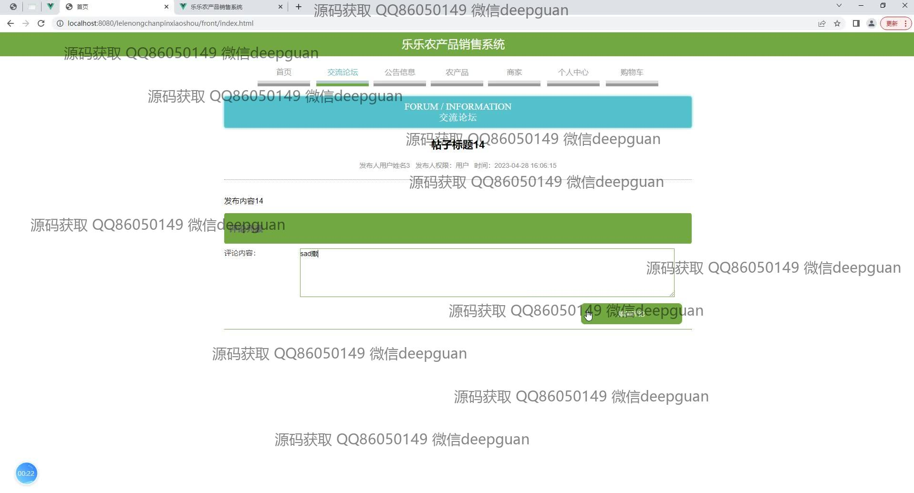

<h1 align="center">乐乐农产品销售系统</h1>

## 简介
乐乐农产品销售系统：角色分为管理员、用户；提供农产品管理、订单管理、用户管理、交流论坛、公告信息等功能，旨在实现便捷的农产品在线体验和管理。    --计算机毕业设计源码；毕设源码；java毕业设计源码

## 联系方式

<h3 align="center">获取完整代码与数据库文件 + 微信：deepguan QQ: 86050149 QQ群: 783742310</h3>

<h3 align="center">可帮忙远程部署 包运行成功！提供远程部署、修改代码、设计文档指导、代码讲解等服务！</h3>

## 功能介绍（完整见运行截图）
管理员：管理农产品销售系统的各项功能，包括用户管理、农产品管理、订单管理和交流论坛管理。具有编辑和更新系统公告、论坛帖子和商家信息的权限。拥有配置轮播图、公告类型和商品信息的能力，确保系统的顺畅运行和内容的时效性。

用户：浏览和购买农产品，操作个人购物车及订单管理。用户可以注册、登录、退出个人账户，管理收货地址和收藏农产品。参与交流论坛，发布和管理帖子及评论，与其他用户互动，积极参与社区建设。

商家：管理自身店铺和商品信息，通过前台与后台用户界面查看订单详情。商家可以发布产品、修改商品信息，并监控订单状态。商家需维护经营的正确信息，确保产品质量，并与平台管理员协调，提升消费者满意度。

游客：无需注册即可浏览平台，查看公告信息、论坛帖子及农产品详情。从产品展示和评论中获得对系统的初步印象，对平台的产品和功能进行探索，以便决定是否注册成为用户参与更多互动。

## 运行截图

本代码来源于网络,仅供学习参考使用!

